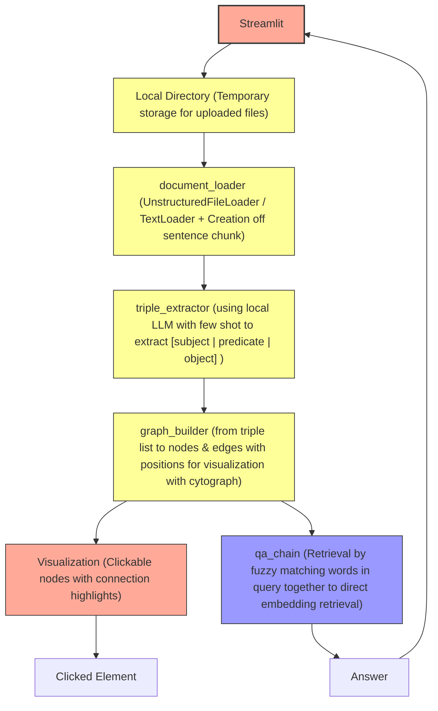

# Knowledge Graph Agent

## Design challenge format
Design an **interactive Streamlit app** to enable **knowledge workers** in **document heavy workflows** to **build and query a knowledge graph from any corpus** with **accurate results using only small open-source models**


## Features
- **File formats**: `.txt`, `.md`, `.pdf`, `.docx`
- **Automated interactive graph creation:** extracting entities & relations as triples via local LLM, using cytoscape from streamlit to display it
- **Context aware QA** using keyword filter and embedding retrieval
- **Open source local model** a .gguf model must be placed in the `models` folder. In testing `mythomax-l2-13b.Q5_K_M` is used


## Architecture


## Installation

1. Clone this repository:
```bash
git clone https://github.com/LaurenzPoll/knowledge_graph_agent.git
```

2. Create a virtual environment and install dependencies:
```bash
python -m venv venv
.\venv\Scripts\Activate.ps1
pip install --upgrade pip
pip install -r requirements.txt
```

## Usage
- Local:
```bash
streamlit run app.py
```

Upload your documents & click `Build Knowledge Graph` or enable the checkbox for the demo version.

With the graph loaded a query form will appear in the sidebar
